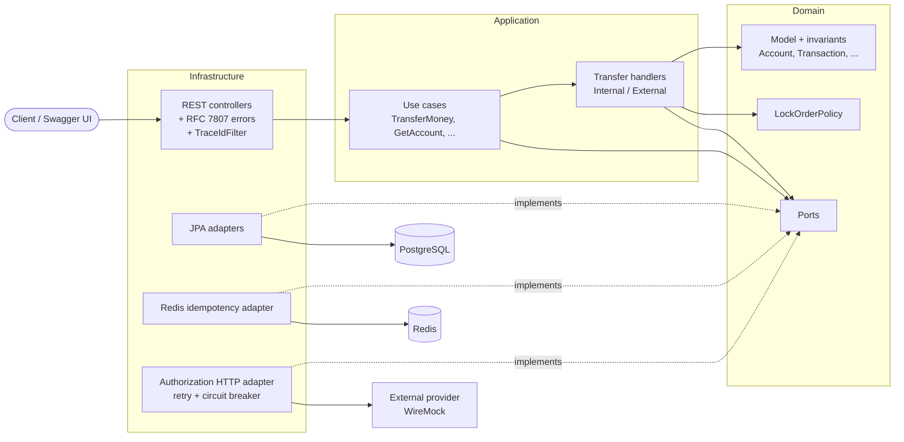
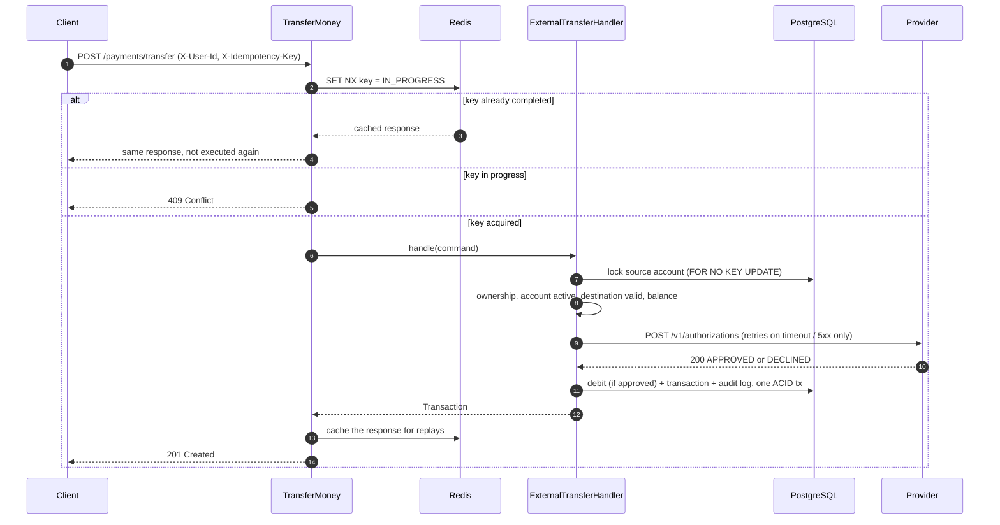

# FluxPay - Payment Gateway Engine

[](https://github.com/kaulinmindiola/payment-gateway-engine/actions/workflows/ci.yml)
[](LICENSE)

**A payment engine that moves money correctly under concurrency, retries and partial failures:
internal and external transfers with pessimistic locking, dual idempotency and a resilient
integration with an unreliable external provider.**

Built with Java 21, Spring Boot, PostgreSQL and Redis, following a hexagonal architecture.
Fully runnable with one command, and verified by a CI pipeline on every change.

---

## Highlights

Every claim below links to the test or document that proves it.

| Guarantee | How | Evidence |
|---|---|---|
| **No lost updates or double debits under concurrency** | Pessimistic row locks inside a single ACID transaction | [20/50 concurrent threads on the same accounts](src/test/java/com/paymentgateway/engine/integration/InternalTransferConcurrencyIT.java) |
| **No deadlocks** | Locks always acquired in a deterministic order ([ADR-0004](docs/adr/0004-pessimistic-locking-with-lock-order-policy.md)) | [40 threads transferring A→B and B→A at the same time](src/test/java/com/paymentgateway/engine/integration/CrossDirectionTransferConcurrencyIT.java) |
| **A retried request never executes twice** | Redis claim + PostgreSQL `UNIQUE` backstop ([ADR-0003](docs/adr/0003-dual-idempotency-redis-postgres.md)) | [Concurrent duplicates](src/test/java/com/paymentgateway/engine/integration/TransferIdempotencyIT.java) · [Redis stopped mid-sequence](src/test/java/com/paymentgateway/engine/integration/RedisOutageIdempotencyIT.java) |
| **Provider failures never duplicate or lose a transfer** | Retry + circuit breaker only on technical failures; business declines are never retried ([ADR-0002](docs/adr/0002-resilience4j-annotations-on-authorization-adapter.md), [ADR-0011](docs/adr/0011-authorization-provider-http-contract.md)) | [Timeouts, 5xx, circuit open, client retries](src/test/java/com/paymentgateway/engine/integration/ExternalTransferResilienceIT.java) |
| **Architecture rules enforced, not just documented** | The domain has no framework dependencies ([ADR-0000](docs/adr/0000-hexagonal-architecture.md)) | [ArchUnit rules](src/test/java/com/paymentgateway/engine/architecture/ArchitectureTest.java), run on every build |
| **Every error is consistent and traceable** | RFC 7807 with a `traceId` that matches the logs ([ADR-0005](docs/adr/0005-traceid-servlet-filter-mdc-json-logging.md)) | [One test per error code](src/test/java/com/paymentgateway/engine/infrastructure/web/exception/ErrorContractTest.java) · [real examples](docs/api/error-examples.md) |
| **Reproducible from a clean checkout** | Docker Compose with health-gated startup ([ADR-0006](docs/adr/0006-docker-compose-single-node-runtime.md)) | `docker-smoke` job in [CI](.github/workflows/ci.yml) |

---

## Quickstart

Requirements: Docker with Docker Compose v2.

```bash
git clone https://github.com/kaulinmindiola/payment-gateway-engine.git
cd payment-gateway-engine
cp .env.example .env
docker compose up --build -d
curl http://localhost:8080/actuator/health        # {"status":"UP", ...}
```

This starts four services: the application, PostgreSQL 16, Redis 7 and a simulated external
authorization provider (WireMock, using the same stubs as the tests). Demo data is seeded.

### Try it in the browser: guided tour

Open **http://localhost:8080/swagger-ui/index.html** and follow the *Guided tour* at the top of
the page. Every example runs with a single click on seeded data: create accounts, transfer money
internally and externally, watch the retries recover a flaky provider, replay a request to see
idempotency, and switch users to see the ownership rules reject access.

### Or from the command line

```bash
BASE=http://localhost:8080/api/v1
ALICE=99999999-9999-9999-9999-999999999999
CHECKING=30000000-0000-0000-0000-000000000001      # Alice, 1000.00
SAVINGS=30000000-0000-0000-0000-000000000002       # Alice, 250.00

# Who am I?
curl -s $BASE/users/me -H "X-User-Id: $ALICE"

# INTERNAL transfer: checking -> savings
curl -s -X POST $BASE/payments/transfer \
  -H "X-User-Id: $ALICE" -H "X-Idempotency-Key: demo-001" -H "Content-Type: application/json" \
  -d "{\"sourceAccountId\":\"$CHECKING\",\"transferType\":\"INTERNAL\",\"targetAccountId\":\"$SAVINGS\",\"amount\":100.00}"

# EXTERNAL transfer to the flaky provider: fails twice, recovered by retries (~3 s)
curl -s -X POST $BASE/payments/transfer \
  -H "X-User-Id: $ALICE" -H "X-Idempotency-Key: demo-002" -H "Content-Type: application/json" \
  -d "{\"sourceAccountId\":\"$CHECKING\",\"transferType\":\"EXTERNAL\",\"targetProviderId\":\"10000000-0000-0000-0000-000000000002\",\"targetBankId\":\"20000000-0000-0000-0000-000000000002\",\"targetExternalReference\":\"REF-FLAKY\",\"amount\":30.00}"

# Transaction history, filtered and paginated
curl -s "$BASE/accounts/$CHECKING/transactions?transferType=EXTERNAL&page=0&size=20" -H "X-User-Id: $ALICE"
```

| Seeded data | Id |
|---|---|
| Alice (user) | `99999999-9999-9999-9999-999999999999` |
| Bob (user) | `88888888-8888-8888-8888-888888888888` |
| Alice checking, 1000.00 | `30000000-0000-0000-0000-000000000001` |
| Alice savings, 250.00 | `30000000-0000-0000-0000-000000000002` |
| Bob's account, 500.00 | `30000000-0000-0000-0000-000000000003` |
| Provider `SWIFT-demo` (reliable) / bank | `10000000-0000-0000-0000-000000000001` / `20000000-0000-0000-0000-000000000001` |
| Provider `RAILS-flaky` (503 → timeout → approved) / bank | `10000000-0000-0000-0000-000000000002` / `20000000-0000-0000-0000-000000000002` |

Reset the demo at any time with `docker compose down -v`.

---

## Architecture

Hexagonal architecture: the domain and the use cases know nothing about HTTP, JPA, Redis or
Resilience4j. They talk to the outside world through ports, implemented by adapters.
The dependency rule is verified by ArchUnit on every build.



### An EXTERNAL transfer, step by step



If Redis is down, the claim is skipped and the PostgreSQL `UNIQUE` constraint on the
idempotency key still prevents a duplicate. If the provider fails technically, nothing is
persisted and the key is released so the client can retry safely.

---

## Key design decisions

Each decision is recorded as an [Architecture Decision Record](docs/adr/README.md), including
the alternatives considered and the trade-offs accepted.

- **Pessimistic locking with a lock order policy**, not optimistic locking: under high contention
  on the same accounts, optimistic retries would fail most transactions. ([ADR-0004](docs/adr/0004-pessimistic-locking-with-lock-order-policy.md))
- **Dual idempotency**: Redis gives a fast answer to duplicates; PostgreSQL guarantees correctness
  when Redis is gone. ([ADR-0003](docs/adr/0003-dual-idempotency-redis-postgres.md))
- **Business results are never exceptions**: a provider DECLINED is a `201` with status `FAILED`;
  only technical failures are retried. ([ADR-0011](docs/adr/0011-authorization-provider-http-contract.md))
- **Strategy pattern for transfer types**, with a single entry point. ([ADR-0009](docs/adr/0009-strategy-pattern-transfer-handlers.md))
- **Ownership in the application layer**, without Spring Security, and why that would change in
  production. ([ADR-0007](docs/adr/0007-ownership-in-application-layer.md))

---

## API overview

Full specification: [`docs/openapi.yaml`](docs/openapi.yaml) (kept in sync with the code by a test)
and Swagger UI when running with Docker Compose.

| Method | Path | Description |
|---|---|---|
| `GET` | `/api/v1/users/me` | Identity behind `X-User-Id` |
| `POST` | `/api/v1/accounts` | Create an account |
| `GET` | `/api/v1/accounts/{id}` | Account details (owner only) |
| `GET` | `/api/v1/accounts/{id}/transactions` | Paginated history, filters: `status`, `transferType`, `dateFrom` (inclusive), `dateTo` (exclusive); `size` ≤ 100 |
| `POST` | `/api/v1/payments/transfer` | INTERNAL or EXTERNAL transfer (idempotent via `X-Idempotency-Key`) |
| `GET` | `/api/v1/transactions/{id}` | A transaction (owner of source or target) |
| `GET` | `/api/v1/external-banks` · `/{id}` | Public catalog of destination banks |

The caller identity is sent in `X-User-Id`. It is **simulated** (no real authentication, by design:
see [ADR-0007](docs/adr/0007-ownership-in-application-layer.md)).

### Errors

Every error uses [RFC 7807](https://www.rfc-editor.org/rfc/rfc7807) (`application/problem+json`)
and carries a `traceId`, also returned in the `X-Trace-Id` header and present in the logs:

```json
{
  "type": "https://payment-gateway-engine/errors/ownership-violation",
  "title": "Forbidden",
  "status": 403,
  "detail": "Requester does not own resource: 30000000-0000-0000-0000-000000000001",
  "instance": "/api/v1/accounts/30000000-0000-0000-0000-000000000001",
  "traceId": "3f2c9d1e-..."
}
```

`400` invalid request · `403` not the owner · `404` not found · `409` same idempotency key in
progress · `422` business rule violated · `503` external provider unavailable.
Real captured examples: [`docs/api/error-examples.md`](docs/api/error-examples.md).

---

## Testing and quality

| Level | What | Tools |
|---|---|---|
| Domain and application | Business rules and use cases with in-memory fakes, no infrastructure | JUnit 5, AssertJ |
| Web | HTTP contract, validation, one test per error code | MockMvc |
| Integration | Real PostgreSQL and Redis, concurrency, Redis outage, provider failures | Testcontainers, WireMock |
| Architecture | Dependency rules of the hexagon | ArchUnit |
| Documentation | `docs/openapi.yaml` in sync with the code, no broken references | Spring Boot test |

**Coverage gate**: at least 80% line coverage on `domain` + `application`, measured **only with
unit tests** (so passing it proves the business logic is testable without infrastructure).
Current value: about 96%. Every uncovered line was reviewed:
[coverage analysis](docs/testing/coverage-analysis.md).

```bash
./mvnw verify                        # unit + integration + ArchUnit + coverage gate
```

The concurrency tests were validated in 10 consecutive runs before being accepted, to rule out
flaky results.

---

## Observability

- **Health**: `GET /actuator/health` (PostgreSQL, Redis, circuit breaker). Any dependency down
  makes it `DOWN` (HTTP 503). Note: it reports dependency health, not the ability to serve
  traffic; without Redis, transfers are still correct ([ADR-0005](docs/adr/0005-traceid-servlet-filter-mdc-json-logging.md)).
- **Metrics**: `GET /actuator/prometheus` (JVM, HTTP, Resilience4j).
- **Logs**: JSON in the docker profile, with the `traceId` of every request.

---

## CI/CD

Every pull request and every merge to `main` runs [`ci.yml`](.github/workflows/ci.yml):

| Job | When | Verifies |
|---|---|---|
| `build-and-test` | PR and `main` | Full test suite and coverage gate |
| `docker-smoke` | PR and `main` | `docker compose up` from the committed state, health `UP`, seeded data |
| `publish-image` | Merge to `main` | Publishes the image to GHCR (`latest` and commit SHA) |

`main` is protected: changes only through pull requests with both checks green.

```bash
docker pull ghcr.io/kaulinmindiola/payment-gateway-engine:latest
```

---

## Tech stack

Java 21 · Spring Boot 3.3 · PostgreSQL 16 · Flyway · Redis 7 · Resilience4j 2.2 ·
springdoc-openapi 2.6 · Logback JSON (logstash encoder) · Micrometer + Prometheus ·
JUnit 5 · Testcontainers · WireMock · ArchUnit · JaCoCo · Docker Compose · GitHub Actions · GHCR

Actual versions differ from the original design constraint; the reasons are documented in
[ADR-0012](docs/adr/0012-spring-boot-stack-downgrade.md).

---

## Running locally without Docker for the app

```bash
cp .env.example .env
docker compose up -d postgres redis authorization-provider
set -a; source .env; set +a          # Spring Boot does not read .env by itself
./mvnw spring-boot:run
```

---

## Project structure

```
src/main/java/com/paymentgateway/engine/
├── domain/            # model, invariants, ports, LockOrderPolicy (no framework dependencies)
├── application/       # use cases, transfer handlers (Strategy)
└── infrastructure/    # web (REST, RFC 7807), persistence (JPA), redis, http (provider), config
docs/
├── adr/               # architecture decision records
├── api/               # real error examples
├── testing/           # coverage analysis
└── openapi.yaml       # API specification
wiremock/mappings/     # provider stubs, shared by tests and Docker Compose
```

---

## What this project deliberately does NOT do

These are conscious exclusions, not postponed features:

- Frontend or mobile apps.
- Real multi-currency (currency conversion): a single implicit currency for accounts and
  transactions; `currency` on external banks is informational metadata only.
- Real cryptographic authentication (OAuth2/JWT).
- Full user management (sign-up, editing, deletion through the API): users are a minimal entity
  seeded by migrations.
- KYC/AML.
- Reports, bulk exports or a complete accounting system.
- Distributed microservices.
- A global listing of transactional resources such as `GET /api/v1/transactions`; only the
  contextual, paginated history of an account is exposed.
- Rate limiting or throttling.
- An endpoint to change an account status.

## Known limitations and possible improvements

- **Idempotency key reused with a different body** returns the original response instead of
  rejecting the request (a stricter design would compare a fingerprint of the body and answer 422).
- **Unexpected 4xx responses from the provider** are not handled explicitly.
- **Health groups**: with an orchestrator, liveness and readiness should be separated (see the
  health note above).
- **Mockito/ByteBuddy dynamic agent warning** on JDK 21: harmless today, will need attention on
  future JDKs.

---

## License

See [LICENSE](LICENSE).