# Software Design Description
## For Payment Gateway Engine

Version 1.1
Prepared by Kaulin Mindiola
2026-09-11

## Table of Contents
<!-- TOC -->
* [1. Introduction](#1-introduction)
  * [1.1 Document Purpose](#11-document-purpose)
  * [1.2 Subject Scope](#12-subject-scope)
  * [1.3 Definitions, Acronyms, and Abbreviations](#13-definitions-acronyms-and-abbreviations)
  * [1.4 References](#14-references)
  * [1.5 Document Overview](#15-document-overview)
* [2. Design Overview](#2-design-overview)
  * [2.1 Stakeholder Concerns](#21-stakeholder-concerns)
  * [2.2 Selected Viewpoints](#22-selected-viewpoints)
* [3. Design Views](#3-design-views)
* [4. Decisions](#4-decisions)
* [5. Appendixes](#5-appendixes)
<!-- TOC -->

## Revision History

| Name | Date | Reason For Changes | Version |
|------|------|---------------------|---------|
| Kaulin Mindiola | 2026-09-08 | Baseline inicial del SDD, derivado del SRS v1.0 y de los ADR-0001 a ADR-0007 (todos `accepted`). | 1.0 | | 2026-09-11 | Corrección de versión de stack: `Spring Boot 3` → `Spring Boot 4` en §1.2 (Subject Scope) y en DV-001 do con `AQ-001` confirmado (Context Maestro §21), SRS v1.1 y la "Nota de implementación" de `ADR-0002`. Se corrige además la referencia obsoleta a `AQ-001` en el resumen de `ADR-0002` (Sección 4). Ninguna vista de diseño cambia de contenido de fondo: el mecanismo de wiring de Resilience4j (módulos core + composición funcional, en vez de anotaciones) es un detalle de implementación ya cubierto conceptualmente por el patrón Circuit Breaker/Retry (DV-014) y no requiere una vista nueva ni modificada. | 1.1 |

## 1. Introduction

### 1.1 Document Purpose

Este SDD describe **cómo** está diseñado el Payment Gateway Engine para satisfacer los requisitos verificables definidos en `srs-payment-gateway-engine.md`, respetando las decisiones arquitectónicas ya aceptadas en `ADR-0001` a `ADR-0007`. Su audiencia principal es quien implementa el sistema (rol de desarrollador/arquitecto único del proyecto) y, secundariamente, cualquier revisor técnico que evalúe el proyecto como pieza de portafolio. Este documento no reemplaza al SRS (que define el *qué*) ni a los ADR (que documentan el *por qué*); su función es conectar ambos con la estructura concreta del sistema (el *cómo*), con suficiente detalle para comenzar la implementación sin que el documento se convierta en código fuente.

### 1.2 Subject Scope

**Payment Gateway Engine**, versión de diseño v1.1, correspondiente al SRS v1.1. Es un backend en Java 21 / Spring Boot 4 que implementa un core transaccional bancario simulado: creación y consulta de cuentas, transferencias de dinero idempotentes y consistentes bajo concurrencia, consulta de transacciones, e integración resiliente con un proveedor de autorización externo simulado.

Este SDD cubre el diseño completo del backend (dominio, aplicación, infraestructura, integración externa y despliegue local). **Excluye** explícitamente, por heredar las exclusiones del SRS (`CON-004`, `CON-008`, `CON-009`, `CON-010`): frontend, multi-moneda, autenticación criptográfica real, endpoints de listado/paginación, rate limiting, y cambio de `AccountStatus` vía API. El modelo de datos formal (DDL) y el contrato exacto request/response con `authorization-provider` quedan **TBD**, diferidos a las etapas de Modelo de Datos y OpenAPI del roadmap (ver Sección 5).

### 1.3 Definitions, Acronyms, and Abbreviations

| Term | Definition |
|---|---|
| ACID | Atomicity, Consistency, Isolation, Durability — propiedades garantizadas por la transacción de PostgreSQL en cada transferencia. |
| Adapter | Componente de `infrastructure/` que implementa un puerto del dominio contra una tecnología concreta (JPA, Redis, HTTP). |
| API | Application Programming Interface. |
| ArchUnit | Framework de test usado para verificar automáticamente que `domain/` no depende de Spring/JPA (`DEC-018`, `ADR-0001`). |
| BR | Business Rule — regla de negocio definida en el SRS/Context Maestro. |
| Circuit Breaker | Patrón de resiliencia que interrumpe temporalmente las llamadas a una dependencia que falla repetidamente (`ADR-0002`). |
| DEC | Decisión técnica registrada originalmente en el Context Maestro (`DEC-001`..`DEC-018`), todas `ACCEPTED`. |
| Hexagonal Architecture (Ports & Adapters) | Estilo arquitectónico donde el dominio expone puertos (interfaces) que la infraestructura implementa mediante adapters, manteniendo el dominio libre de dependencias de framework (`CON-002`). |
| Idempotency Key | Valor provisto por el cliente (`X-Idempotency-Key`) que garantiza que una transferencia no se ejecute más de una vez (`BR-002`). |
| MDC | Mapped Diagnostic Context — mecanismo de SLF4J/Logback usado para propagar el `traceId` en cada línea de log (`ADR-0005`). |
| Owner | Identificador (`owner_id`) del `X-User-Id` que controla una cuenta. |
| Pessimistic Locking | Estrategia de concurrencia que bloquea filas de base de datos durante la transacción para prevenir condiciones de carrera (`CON-003`, `ADR-0004`). |
| Port | Interfaz definida en `domain/` que expresa una necesidad del dominio (persistencia, autorización externa, idempotencia) sin conocer su implementación. |
| RFC 7807 | Estándar IETF ("Problem Details for HTTP APIs") usado como formato uniforme de error en toda la API (`DEC-011`). |
| SDD | Software Design Description — este documento. |
| SRS | Software Requirements Specification — `srs-payment-gateway-engine.md`. |
| Use Case | Componente de `application/` que orquesta un flujo de negocio invocando puertos del dominio (p. ej. `TransferMoney`). |
| WireMock | Herramienta usada para simular el `authorization-provider` externo, tanto en tests como en Docker Compose. |

### 1.4 References

| Referencia | Tipo | Ubicación |
|---|---|---|
| `srs-payment-gateway-engine.md` | Normativa (requisitos, WHAT) | Repositorio del proyecto |
| `payment-gateway-engine-context-maestro.md` | Normativa (descubrimiento y decisiones de producto) | Repositorio del proyecto |
| `ADR-0001` — Mapeo domain↔JPA | Normativa (WHY) | `adr/0001-mapeo-domain-jpa.md` |
| `ADR-0002` — Cliente HTTP y resiliencia hacia authorization-provider | Normativa (WHY) | `adr/0002-cliente-resiliencia-authorization-provider.md` |
| `ADR-0003` — Idempotencia dual Redis + PostgreSQL | Normativa (WHY) | `adr/0003-idempotencia-redis-postgresql.md` |
| `ADR-0004` — Locking pesimista y orden anti-deadlock | Normativa (WHY) | `adr/0004-locking-pesimista-orden-antideadlock.md` |
| `ADR-0005` — TraceId y logging estructurado | Normativa (WHY) | `adr/0005-traceid-logging-estructurado.md` |
| `ADR-0006` — Topología Docker Compose | Normativa (WHY) | `adr/0006-topologia-docker-compose.md` |
| `ADR-0007` — Autorización por ownership sin framework | Normativa (WHY) | `adr/0007-autorizacion-ownership-sin-framework.md` |
| RFC 7807 — Problem Details for HTTP APIs | Informativa | https://www.rfc-editor.org/rfc/rfc7807 |
| Documentación de Resilience4j | Informativa | https://resilience4j.readme.io |
| Documentación de ArchUnit | Informativa | https://www.archunit.org |

### 1.5 Document Overview

La Sección 2 conecta las preocupaciones de los stakeholders con los viewpoints seleccionados para representarlas, justificando explícitamente los viewpoints descartados. La Sección 3 contiene las vistas de diseño concretas (diagramas y descripciones), organizadas por viewpoint, cada una referenciando los requisitos del SRS que implementa. La Sección 4 resume las decisiones arquitectónicas, remitiendo al ADR correspondiente como fuente detallada del razonamiento. La Sección 5 referencia material de apoyo sin duplicarlo.

## 2. Design Overview

El Payment Gateway Engine se diseña como un **monolito modular** con Arquitectura Hexagonal estricta (`CON-002`), desplegado como un único proceso Java dentro de una topología Docker Compose de 4 servicios (`DEC-005`). No hay justificación, dado el alcance y las restricciones del proyecto (`CON-004`, `CON-007`), para introducir distribución, mensajería asíncrona o múltiples bases de datos: la complejidad del sistema está en la **corrección bajo concurrencia y fallos parciales**, no en la escala o distribución (ver regla de no sobrearquitectura).

### 2.1 Stakeholder Concerns

| Stakeholder | Concern | Viewpoint(s) que lo aborda |
|---|---|---|
| Cliente API | Contrato de API estable y predecible; errores uniformes (RFC 7807); idempotencia confiable ante reintentos de red | Interface, Interaction, State Dynamics |
| Desarrollador/Mantenedor | Estructura clara y desacoplada; dominio testeable sin infraestructura real; bajo acoplamiento entre capas | Composition, Logical, Dependency, Patterns |
| Arquitecto/Revisor técnico (portafolio) | Decisiones justificadas con trade-offs explícitos; ausencia de sobre-ingeniería; trazabilidad completa a requisitos | Sección 4 (Decisions) + trazabilidad cruzada en todas las vistas |
| Operador/DevOps | Arranque reproducible con un solo comando; salud observable; configuración externalizada | Deployment, Context |
| Sistema externo (`authorization-provider` simulado) | Contrato de integración estable, aislado del dominio, con semántica clara de fallo técnico vs. resultado de negocio | Interface, Interaction, Patterns |

### 2.2 Selected Viewpoints

Cada viewpoint del catálogo se evalúa explícitamente. Se selecciona únicamente cuando existe una preocupación real (Sección 2.1) que lo justifica.

#### 2.2.1 Context
**Seleccionado: Sí.** El sistema tiene límites claros (Cliente API, Operador/DevOps, `authorization-provider` externo) que deben documentarse una única vez como referencia. Ver DV-001.

#### 2.2.2 Composition
**Seleccionado: Sí.** La estructura hexagonal (`domain/application/infrastructure`) es el elemento organizativo central del sistema y condiciona directamente `ADR-0001`. Ver DV-002.

#### 2.2.3 Logical
**Seleccionado: Sí, con alcance acotado.** Solo se modelan las abstracciones estables del dominio (`Account`, `Transaction`, `TransactionLog`, puertos) — no se documentan clases de infraestructura triviales (DTOs, mappers). Ver DV-004.

#### 2.2.4 Physical
**No seleccionado — N/A.** El sistema se ejecuta sobre cualquier host compatible con Docker (`REQ-PORT-001`); no existen restricciones de hardware específicas que documentar. La topología física se reduce a la topología de contenedores, ya cubierta por el viewpoint Deployment (DV-015).

#### 2.2.5 Structure
**No seleccionado — N/A.** Ningún componente del sistema tiene una estructura interna compuesta (puertos/conectores internos) lo suficientemente compleja como para justificar una vista separada de Composition; el detalle adicional que aportaría ya está cubierto por DV-002 y DV-004.

#### 2.2.6 Dependency
**Seleccionado: Sí.** `CON-002` impone una regla de dependencia estricta y verificada automáticamente (ArchUnit); merece una vista propia que la haga explícita más allá de la composición general. Ver DV-003.

#### 2.2.7 Information
**Seleccionado: Sí.** El modelo de datos (`accounts`, `transactions`, `transaction_logs`) es central para `BR-001` a `BR-011` y para la auditabilidad (`NFR-AUDIT-01`). Ver DV-005. El DDL formal queda `TBD` (etapa Data Model del roadmap).

#### 2.2.8 Interface
**Seleccionado: Sí.** El contrato HTTP expuesto y el contrato de `AuthorizationPort` son la superficie de integración más relevante del sistema (`REQ-INT-001`, `REQ-INT-002`). Ver DV-006.

#### 2.2.9 Interaction
**Seleccionado: Sí.** El flujo de transferencia tiene múltiples caminos (éxito, idempotencia, `DECLINED`, indisponibilidad) cuyo orden y sincronización no son evidentes solo con la vista de Composition. Ver DV-007, DV-008, DV-009.

#### 2.2.10 Algorithm
**Seleccionado: Sí, acotado a un único algoritmo.** El ordenamiento anti-deadlock (`DEC-001`) es un algoritmo pequeño pero crítico para la corrección del sistema; se documenta explícitamente para que su implementación no varíe. Ver DV-011. No se documentan otros algoritmos (p. ej. cálculo de backoff) por ser triviales o ya completamente especificados por configuración (`DEC-012`).

#### 2.2.11 State Dynamics
**Seleccionado: Sí.** Tanto el ciclo de vida de una `Transaction` (`BR-010`, `REQ-FUNC-017`) como el de una `idempotency_key` (`BR-002`) son máquinas de estado con transiciones no triviales que el SRS especifica por comportamiento pero no por diagrama. Ver DV-012, DV-013.

#### 2.2.12 Concurrency
**Seleccionado: Sí.** Es el concern arquitectónico más crítico del proyecto (`AC-001`, `CS-01`, `CS-02`); merece una vista dedicada más allá de lo que muestra Interaction. Ver DV-010.

#### 2.2.13 Patterns
**Seleccionado: Sí.** El sistema aplica varios patrones nombrados (Hexagonal, Circuit Breaker, Retry, Idempotency Key, Repository) cuya identificación explícita ayuda a un revisor a reconocer las decisiones sin releer cada ADR. Ver DV-014.

#### 2.2.14 Deployment
**Seleccionado: Sí.** La topología de 4 servicios y su orden de arranque son parte del criterio de éxito `CS-04`. Ver DV-015.

#### 2.2.15 Resources
**No seleccionado — N/A.** No existe contención de recursos compartidos más allá de pools de conexión estándar de PostgreSQL/Redis, gestionados por defaults de Spring Boot. `CON-007` explícitamente marca el rendimiento como indicativo, no como SLA — no hay una preocupación real de asignación de recursos que justifique un viewpoint dedicado en este alcance.

## 3. Design Views

### 3.1 Context

- ID: DV-001-system-context
- Title: Contexto del sistema — actores y sistema externo
- Viewpoint: Context
- Representation:

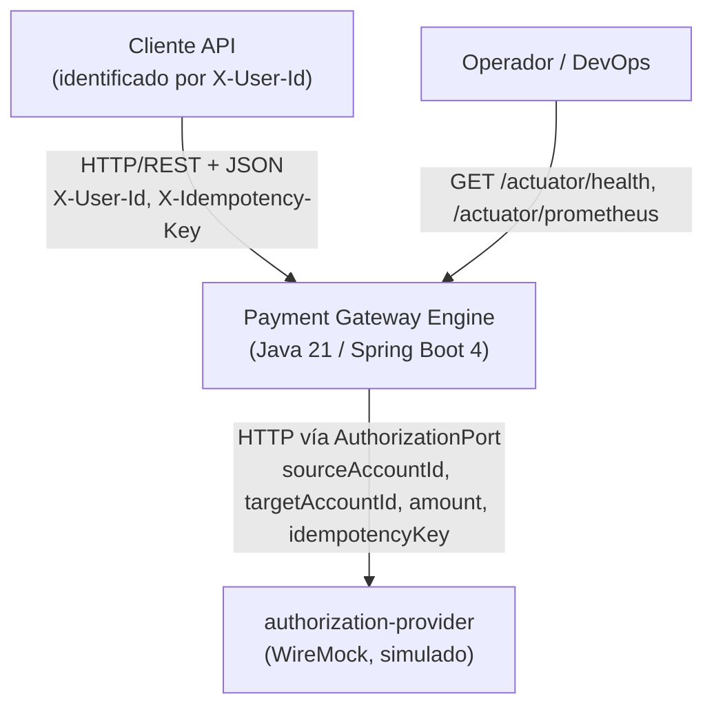

- More Information: Implementa `REQ-INT-001`, `REQ-INT-002`. Actores según Sección 3 del Context Maestro. El dominio no conoce a `authorization-provider` directamente — solo a `AuthorizationPort` (`DEC-009`, DV-003).

### 3.2 Composition

- ID: DV-002-hexagonal-composition
- Title: Composición hexagonal — capas y componentes principales
- Viewpoint: Composition
- Representation:

```mermaid
graph TB
    subgraph infrastructure["infrastructure/"]
        RestControllers["REST Controllers<br/>(Accounts, Payments, Transactions)"]
        JpaAdapters["JPA Repository Adapters"]
        RedisAdapter["Redis Idempotency Adapter"]
        HttpAdapter["Authorization HTTP Adapter<br/>(RestClient + Resilience4j)"]
        ExceptionHandler["Global Exception Handler (RFC 7807)"]
        TraceFilter["TraceId Filter (MDC)"]
    end
    subgraph application["application/"]
        CreateAccountUC["CreateAccount"]
        GetAccountUC["GetAccount"]
        TransferMoneyUC["TransferMoney"]
        GetTransactionUC["GetTransaction"]
        LockOrderPolicy["LockOrderPolicy"]
    end
    subgraph domain["domain/ (sin dependencias de framework)"]
        AccountEntity["Account"]
        TransactionEntity["Transaction"]
        TransactionLogEntity["TransactionLog"]
        AccountRepoPort["AccountRepositoryPort (puerto)"]
        TransactionRepoPort["TransactionRepositoryPort (puerto)"]
        IdempotencyPort["IdempotencyPort (puerto)"]
        AuthorizationPort["AuthorizationPort (puerto)"]
    end

    RestControllers --> CreateAccountUC
    RestControllers --> GetAccountUC
    RestControllers --> TransferMoneyUC
    RestControllers --> GetTransactionUC
    TransferMoneyUC --> LockOrderPolicy
    TransferMoneyUC --> AccountRepoPort
    TransferMoneyUC --> TransactionRepoPort
    TransferMoneyUC --> IdempotencyPort
    TransferMoneyUC --> AuthorizationPort
    CreateAccountUC --> AccountRepoPort
    GetAccountUC --> AccountRepoPort
    GetTransactionUC --> TransactionRepoPort

    JpaAdapters -. implementa .-> AccountRepoPort
    JpaAdapters -. implementa .-> TransactionRepoPort
    RedisAdapter -. implementa .-> IdempotencyPort
    HttpAdapter -. implementa .-> AuthorizationPort
```

- More Information: Implementa `CON-002`, `DEC-009`. Refleja `ADR-0001` (mapeo manual domain↔JPA), `ADR-0002` (adapter HTTP), `ADR-0003` (adapter Redis). Resuelve `DG-001` (estructura de paquetes) del backlog de discovery.

### 3.3 Dependency

- ID: DV-003-dependency-direction
- Title: Dirección de dependencias y regla de aislamiento del dominio
- Viewpoint: Dependency
- Representation:

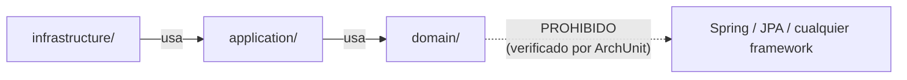

- More Information: Implementa `CON-002`, `REQ-MAINT-001`, `DEC-018`. Detalla la regla verificada automáticamente descrita en `ADR-0001`. La flecha punteada representa una dependencia explícitamente prohibida, no una relación de uso.

### 3.4 Logical

- ID: DV-004-domain-model
- Title: Modelo lógico del dominio
- Viewpoint: Logical
- Representation:

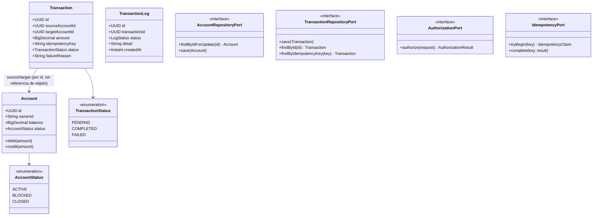

- More Information: Implementa `REQ-FUNC-001` a `REQ-FUNC-020`, `BR-001` a `BR-011`. No incluye DTOs de infraestructura (fuera del alcance de este viewpoint, ver 2.2.5). `version` de `Account` (optimistic locking secundario, Sección 13 del Context Maestro) se omite por no estar en uso en esta versión.

### 3.5 Information

- ID: DV-005-data-model-draft
- Title: Modelo de datos (borrador, DDL formal TBD)
- Viewpoint: Information
- Representation:

| Tabla | Campos clave | Notas |
|---|---|---|
| `accounts` | `id` (PK), `owner_id`, `balance NUMERIC(19,2)`, `status`, `version`, `created_at`/`updated_at` | `balance` nunca negativo (`BR-001`); `version` reservado para optimistic locking secundario, sin uso actual |
| `transactions` | `id` (PK), `source_account_id` (FK), `target_account_id` (FK), `amount`, `idempotency_key` **UNIQUE**, `status`, `failure_reason`, `created_at`/`updated_at` | `idempotency_key` **UNIQUE** es el backstop de `ADR-0003` ante caída de Redis |
| `transaction_logs` | `id` (PK), `transaction_id` (FK), `status`, `detail`, `created_at` | Append-only, inmutable; sin `updated_at` (`REQ-FUNC-019`) |

- More Information: Fuente: Sección 11 del Context Maestro. Implementa `REQ-FUNC-019`, `NFR-AUDIT-01`, `BR-001`, `DEC-002`. **TBD:** DDL formal completo (tipos exactos de enum, índices, constraints de FK) — diferido a la etapa "Data Model" del roadmap (`DG-002`).

### 3.6 Interface

- ID: DV-006-api-contracts
- Title: Contratos de interfaz — API expuesta y AuthorizationPort
- Viewpoint: Interface
- Representation:

**(a) API expuesta a Cliente API**

| Método | Ruta | Auth | Requisito |
|---|---|---|---|
| POST | `/api/v1/accounts` | `X-User-Id` | `REQ-FUNC-001` a `REQ-FUNC-003` |
| GET | `/api/v1/accounts/{id}` | `X-User-Id` (ownership) | `REQ-FUNC-004` a `REQ-FUNC-006` |
| POST | `/api/v1/payments/transfer` | `X-User-Id` + `X-Idempotency-Key` | `REQ-FUNC-007` a `REQ-FUNC-018` |
| GET | `/api/v1/transactions/{id}` | `X-User-Id` (ownership) | `REQ-FUNC-020` |
| GET | `/actuator/health` | ninguna | `REQ-OBS-001` |
| GET | `/actuator/prometheus` | ninguna | `NFR-OBS-01` |

Todo error 4xx/5xx sigue RFC 7807: `{type, title, status, detail, instance, traceId}` (`REQ-INT-001`).

**(b) Contrato `AuthorizationPort` (provisional)**

```
authorize(sourceAccountId, targetAccountId, amount, idempotencyKey) -> AuthorizationResult

AuthorizationResult:
  - APPROVED
  - DECLINED
  - (excepción técnica: timeout / no disponible — nunca parte del resultado de negocio)
```

- More Information: Implementa `REQ-INT-001`, `REQ-INT-002`. El contrato de `AuthorizationPort` es **TBD** en su forma exacta de request/response HTTP (campos adicionales, selección de escenario en WireMock) — se resuelve formalmente en la etapa OpenAPI (`Q-008`, `DG-003`). La separación entre `DECLINED` (valor de retorno) y fallo técnico (excepción) implementa `ADR-0002`.

### 3.7 Interaction

- ID: DV-007-happy-path-transfer
- Title: Secuencia — transferencia exitosa (happy path)
- Viewpoint: Interaction
- Representation:

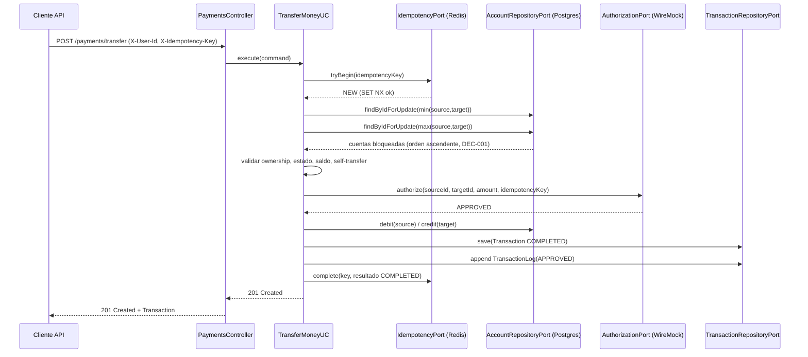

- More Information: Implementa `REQ-FUNC-007`, `REQ-FUNC-010` a `REQ-FUNC-017`. Combina `DEC-001` (orden de locks) y `ADR-0004` (implementación del locking).

---

- ID: DV-008-idempotent-replay
- Title: Secuencia — solicitud concurrente e idempotencia
- Viewpoint: Interaction
- Representation:

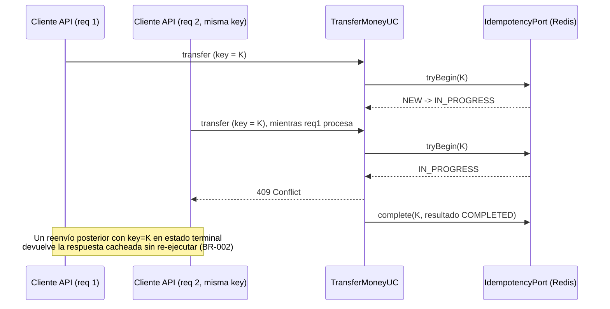

- More Information: Implementa `REQ-FUNC-007` a `REQ-FUNC-009`. Detalla `ADR-0003` a nivel de secuencia.

---

- ID: DV-009-declined-unavailable-paths
- Title: Secuencia — resultado DECLINED vs. indisponibilidad técnica
- Viewpoint: Interaction
- Representation:

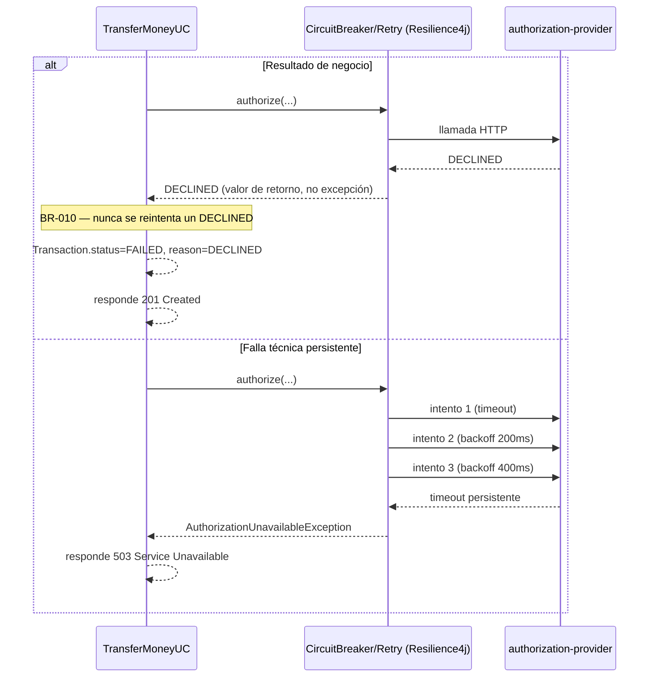

- More Information: Implementa `REQ-FUNC-016` a `REQ-FUNC-018`, `BR-010`. Es la representación operativa de la jerarquía de excepciones decidida en `ADR-0002`.

### 3.8 Concurrency

- ID: DV-010-crossed-transfer-locking
- Title: Transferencias cruzadas concurrentes A→B / B→A
- Viewpoint: Concurrency
- Representation:

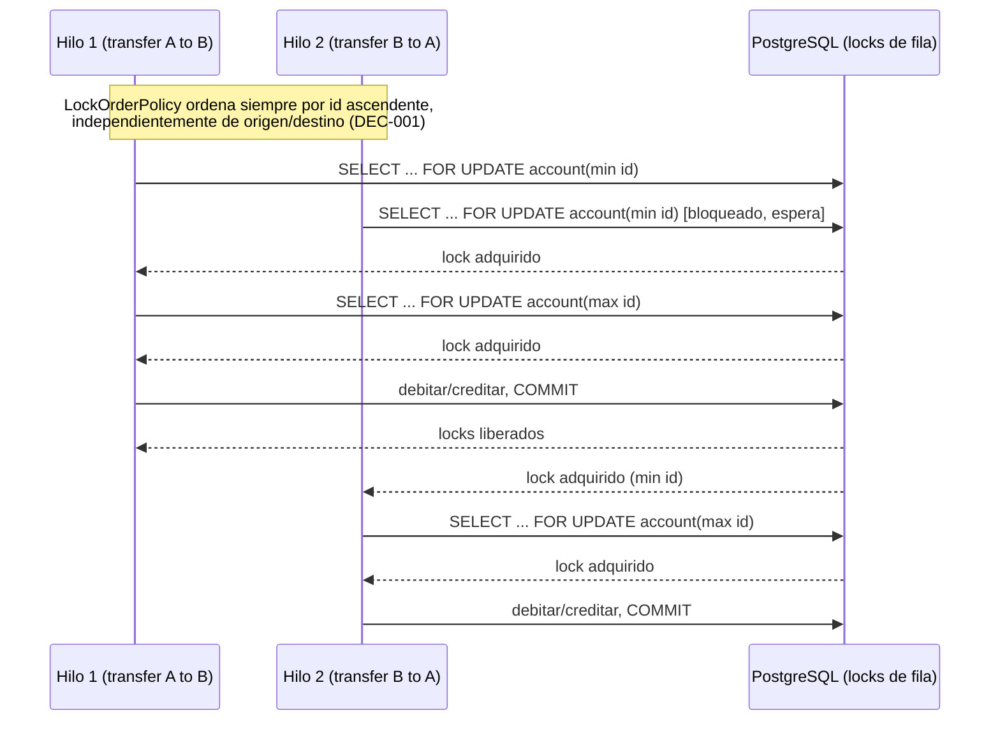

- More Information: Implementa `REQ-FUNC-015`, `RISK-001`. Ambos hilos convergen en el mismo orden de adquisición (ascendente por id) sin importar cuál es origen y cuál destino, eliminando la posibilidad de espera circular. Verificado por el test de concurrencia de `REQ-FUNC-015`.

### 3.9 Algorithm

- ID: DV-011-lock-order-policy
- Title: Algoritmo de ordenamiento anti-deadlock
- Viewpoint: Algorithm
- Representation:

```
función resolveLockOrder(sourceId, targetId):
    si sourceId < targetId:
        retornar (primero = sourceId, segundo = targetId)
    si no:
        retornar (primero = targetId, segundo = sourceId)

# Invocado una única vez por transferencia, antes de cualquier
# findByIdForUpdate(). El resultado determina el orden de las dos
# llamadas secuenciales de bloqueo, independientemente de cuál
# cuenta es origen y cuál destino.
```

- More Information: Implementa `DEC-001`. Componente aislado y testeable unitariamente según `ADR-0004`. La comparación usa el orden natural de `UUID`; no depende de ningún estado externo.

### 3.10 State Dynamics

- ID: DV-012-transaction-lifecycle
- Title: Ciclo de vida de una Transaction
- Viewpoint: State Dynamics
- Representation:

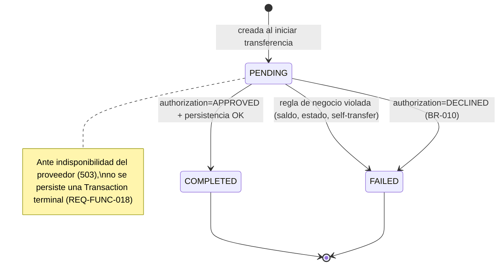

- More Information: Implementa `REQ-FUNC-011` a `REQ-FUNC-018`, `BR-010`. `REVERSED` (Sección 11 del Context Maestro) no aparece: ningún caso de uso de este alcance lo dispara (`ASM-002`).

---

- ID: DV-013-idempotency-key-lifecycle
- Title: Ciclo de vida de una idempotency key
- Viewpoint: State Dynamics
- Representation:

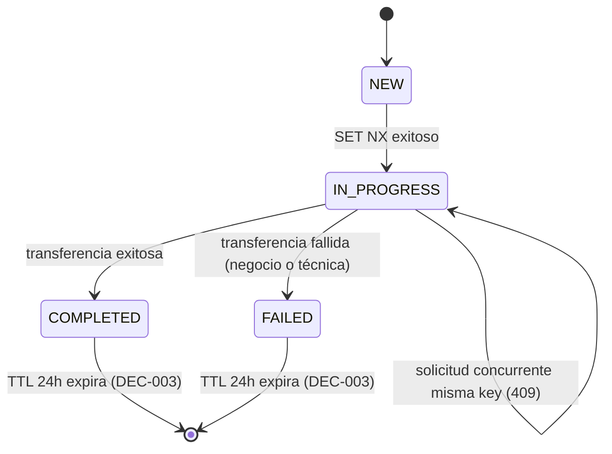

- More Information: Implementa `REQ-FUNC-007` a `REQ-FUNC-009`, `BR-002`, `DEC-003`. Complementa `ADR-0003`.

### 3.11 Patterns

- ID: DV-014-applied-patterns
- Title: Patrones de diseño y arquitectura aplicados
- Viewpoint: Patterns
- Representation:

| Patrón | Dónde se aplica | Decisión relacionada |
|---|---|---|
| Hexagonal Architecture / Ports & Adapters | Separación `domain/application/infrastructure` | `CON-002`, `ADR-0001` |
| Repository | `AccountRepositoryPort`, `TransactionRepositoryPort` | `ADR-0001` |
| Circuit Breaker | Llamadas a `authorization-provider` | `DEC-012`, `ADR-0002` |
| Retry con backoff exponencial | Errores transitorios hacia `authorization-provider` | `DEC-012`, `ADR-0002` |
| Idempotency Key (check-and-set) | Redis `SET NX` + backstop `UNIQUE` en PostgreSQL | `DEC-002`, `DEC-003`, `ADR-0003` |
| Correlation ID / MDC | `traceId` propagado en logs y respuestas de error | `DEC-011`, `ADR-0005` |
| Policy Object aislado | `LockOrderPolicy` | `DEC-001`, `ADR-0004` |

- More Information: Cada patrón está justificado por un ADR específico — no se listan patrones aplicados "por costumbre" sin decisión asociada (regla de no sobrearquitectura).

### 3.12 Deployment

- ID: DV-015-docker-compose-topology
- Title: Topología de despliegue — Docker Compose
- Viewpoint: Deployment
- Representation:

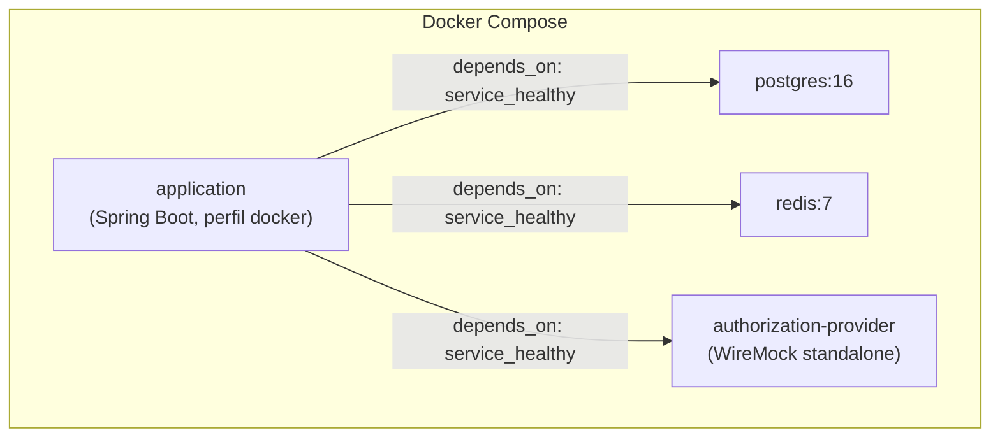

Configuración vía `.env` (no versionado) + bloque `environment` referenciando `${VAR}`; perfil `application-docker.yml` para overrides de contenedor.

- More Information: Implementa `REQ-INST-001`, `REQ-INST-002`, `CS-04`, `DEC-005`, `DEC-017`. Detalle completo de justificación en `ADR-0006`.

## 4. Decisions

Esta sección resume las decisiones arquitectónicas ya `accepted`. El razonamiento completo (drivers, alternativas, trade-offs, consecuencias, confirmación) vive en el ADR referenciado — no se duplica aquí.

- ID: ADR-0001
- Title: Mapeo manual entre el dominio puro y las entidades JPA
- Context: `CON-002` exige que `domain/` no dependa de Spring/JPA; la persistencia real requiere JPA.
- Options: Modelos JPA separados con mapeo manual · Dominio anotado directamente con JPA · Modelos JPA separados con MapStruct.
- Outcome: Modelos JPA separados con mapeo manual, por ser la única opción compatible con `CON-002` y proporcionada al tamaño del modelo (3 entidades).
- More Information: `adr/0001-mapeo-domain-jpa.md`.

---

- ID: ADR-0002
- Title: Cliente HTTP y estrategia de resiliencia hacia authorization-provider
- Context: Invocar al proveedor externo con Circuit Breaker + Retry sin que `DECLINED` (resultado de negocio) dispare reintentos.
- Options: RestClient síncrono + jerarquía de excepciones · WebClient reactivo · RestTemplate.
- Outcome: RestClient síncrono con jerarquía de excepciones que separa fallos técnicos de `DECLINED`, coherente con el resto del sistema (bloqueante). Decisión reforzada, no reabierta, por la confirmación de `AQ-001`: en Spring Boot 4 / Spring Framework 7, `RestTemplate` queda deprecado en favor de `RestClient`.
- More Information: `adr/0002-cliente-resiliencia-authorization-provider.md`. `AQ-001` confirmado: Spring Boot 4.1.x (Context Maestro §21). Ver "Nota de implementación" del ADR: Circuit Breaker/Retry se integran vía módulos core de Resilience4j (`resilience4j-circuitbreaker`, `resilience4j-retry`, `resilience4j-micrometer`) con composición funcional en `AuthorizationHttpAdapter`, no vía starter `-spring-bootN` (inexistente para Boot 4) ni anotaciones `@CircuitBreaker`/`@Retry`. Los valores de `DEC-012` no cambian.

---

- ID: ADR-0003
- Title: Mecanismo dual de idempotencia (Redis + PostgreSQL)
- Context: Implementar `SET NX` en Redis con degradación al `UNIQUE` constraint de PostgreSQL cuando Redis no está disponible.
- Options: Intercepción a nivel de caso de uso con fallback por excepción de integridad · Solo PostgreSQL · Redisson.
- Outcome: Intercepción a nivel de caso de uso, único camino que satisface `REQ-REL-004` respetando `DEC-002`/`DEC-003`.
- More Information: `adr/0003-idempotencia-redis-postgresql.md`.

---

- ID: ADR-0004
- Title: Formalización del locking pesimista con orden anti-deadlock
- Context: Implementar `DEC-001` (orden ascendente de locks) de forma testeable y consistente con el resto de la capa de persistencia.
- Options: JPA `@Lock(PESSIMISTIC_WRITE)` + `LockOrderPolicy` aislado · SQL nativo `FOR UPDATE` vía JDBC · Optimistic locking.
- Outcome: JPA `@Lock(PESSIMISTIC_WRITE)` + `LockOrderPolicy`, manteniendo un único mecanismo de acceso a datos.
- More Information: `adr/0004-locking-pesimista-orden-antideadlock.md`.

---

- ID: ADR-0005
- Title: Propagación de traceId y logging estructurado
- Context: Correlacionar `traceId` entre respuestas de error RFC 7807 y logs (`REQ-OBS-002`).
- Options: Servlet Filter + MDC + Logback JSON · Micrometer Tracing + Brave/OTel.
- Outcome: Filter + MDC, suficiente para un monolito de un solo nodo sin grafo de servicios que justifique tracing distribuido.
- More Information: `adr/0005-traceid-logging-estructurado.md`.

---

- ID: ADR-0006
- Title: Topología Docker Compose con healthchecks y configuración externalizada
- Context: Arranque reproducible de los 4 servicios con un solo comando (`REQ-INST-001`).
- Options: `depends_on` con `service_healthy` + `.env` · Sin healthchecks, confiando en reintentos de Spring Boot.
- Outcome: `depends_on` con `service_healthy`, elimina flakiness de arranque.
- More Information: `adr/0006-topologia-docker-compose.md`.

---

- ID: ADR-0007
- Title: Autorización por ownership sin framework de seguridad
- Context: Resolver el chequeo de ownership (`BR-008`, `BR-009`) sin introducir Spring Security, dado `CON-004`/`CON-006`.
- Options: Bean Validation + comparación explícita en la capa de aplicación · Spring Security con `AuthenticationProvider` custom.
- Outcome: Comparación explícita en la capa de aplicación, proporcional al tamaño real del problema (2 recursos protegidos).
- More Information: `adr/0007-autorizacion-ownership-sin-framework.md`. Decisión de bajo peso arquitectónico, documentada por completitud del proceso.

## 5. Appendixes

- **SRS** (`srs-payment-gateway-engine.md`): fuente completa de requisitos verificables (`REQ-xxx`), trazables a los casos de uso y reglas de negocio del Context Maestro.
- **Context Maestro** (`payment-gateway-engine-context-maestro.md`): fuente de descubrimiento original — decisiones de producto, riesgos `RISK-001` a `RISK-008`, supuestos y modelo de datos borrador (Sección 11).
- **ADR-0001 a ADR-0007**: razonamiento completo de cada decisión arquitectónica resumida en la Sección 4.
- **Riesgos arquitectónicos adicionales identificados durante el discovery de diseño** (no duplicados del Context Maestro): `RISK-009` (drift en mapeo domain↔JPA), `RISK-010` (mezcla de canal técnico/negocio en la integración de autorización, mitigado por `ADR-0002`), `RISK-011` (sobre-ingeniería de tracing distribuido, evitada por `ADR-0005`).
- **Design Gaps abiertos** (no bloqueantes para esta versión del SDD):
  - `DG-002` — DDL formal del modelo de datos: diferido a la etapa "Data Model" del roadmap.
  - `DG-003` — Contrato exacto request/response con `authorization-provider`: diferido a la etapa "OpenAPI" del roadmap (`Q-008`).
  - `DG-001` (estructura de paquetes) se considera **resuelto** por DV-002/DV-003 de este documento.
- **Próximos artefactos del roadmap** (Sección 22 del Context Maestro): Modelo de Datos definitivo + DDL, OpenAPI (accounts, payments/transfer, transactions), Threat Model, Test Plan, Deployment Documentation (`docker-compose.yml`, README).
